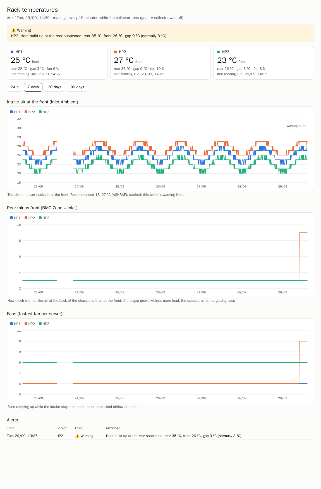

# ilo-thermal – documentation complète (français)

[English](en.md) · [Deutsch](de.md) · [Español](es.md) · [README](../README.md)

---

## Sommaire

1. [Pourquoi cet outil](#1-pourquoi-cet-outil)
2. [Fonctionnement](#2-fonctionnement)
3. [Prérequis](#3-prérequis)
4. [Capteurs utilisés, et pourquoi](#4-capteurs-utilisés-et-pourquoi)
5. [Installation](#5-installation)
6. [Référence de configuration](#6-référence-de-configuration)
7. [Règles d'alerte en détail](#7-règles-dalerte-en-détail)
8. [Quand le collecteur n'est pas allumé en permanence](#8-quand-le-collecteur-nest-pas-allumé-en-permanence)
9. [Le rapport HTML](#9-le-rapport-html)
10. [Fichiers, données et rétention](#10-fichiers-données-et-rétention)
11. [Dépannage](#11-dépannage)
12. [Sécurité](#12-sécurité)
13. [Limites et adaptation à d'autres modèles](#13-limites-et-adaptation-à-dautres-modèles)
14. [Clause de non-responsabilité](#14-clause-de-non-responsabilité)

---

## 1. Pourquoi cet outil

L'iLO 5 de HPE n'affiche les températures et la vitesse des ventilateurs **qu'en direct**. Il n'y
a pas d'historique : on voit que l'air aspiré est à 25 °C maintenant, mais pas ce qu'il était la
nuit dernière, pendant la dernière canicule, ni si un serveur de la baie chauffe lentement plus
que ses voisins.

`ilo-thermal` comble ce manque :

- il interroge chaque iLO via Redfish (lecture seule) toutes les 10 minutes et conserve les
  valeurs dans SQLite,
- il alerte sur des seuils absolus, des sauts brusques et une **accumulation de chaleur
  présumée à l'arrière**,
- il rattrape le journal d'événements de l'iLO (IML) quand la machine qui l'exécute était éteinte,
- et il génère un rapport HTML autonome avec des graphiques.

Il a été conçu pour une petite baie de homelab avec trois serveurs HPE (ProLiant DL20 Gen10 Plus
et MicroServer Gen10 Plus v2) et un « jump host » Linux qui ne tourne **pas** en permanence.

## 2. Fonctionnement

```
 cron (toutes les 10 min, et une fois après le démarrage)
   └─ run.sh ── flock ──┬─ ilo_thermal.py collect
                        │     ├─ GET /redfish/v1/Chassis/1/Thermal/          (par iLO)
                        │     ├─ GET /redfish/v1/Systems/1/LogServices/IML/Entries/ (toutes les heures / après une interruption)
                        │     ├─ enregistrement des mesures → ilo_thermal.db (SQLite)
                        │     ├─ évaluation des règles d'alerte
                        │     └─ notification (mail, journal, historique)
                        └─ ilo_thermal.py report
                              └─ report/index.html (graphiques, alertes, historique)
```

- **Lecture seule :** uniquement des requêtes HTTP `GET`. Rien n'est modifié sur l'iLO ni sur le serveur.
- **Bibliothèque standard uniquement :** Python 3.9+, pas de `pip install`, ni `requests`, ni
  `matplotlib`. Les graphiques sont des SVG générés dans le navigateur à partir des données
  intégrées au rapport.
- **TLS vérifié :** le script se connecte à l'adresse IP de l'iLO, mais vérifie le certificat par
  rapport à votre autorité de certification *et* au nom DNS inscrit dans le certificat. Cela
  fonctionne même si le collecteur n'utilise pas le serveur DNS qui connaît les noms des iLO
  (par exemple une zone interne Active Directory).

## 3. Prérequis

| Élément | Détails |
|---|---|
| Serveurs | HPE ProLiant avec **iLO 5** (Gen10 / Gen10 Plus). Testé : DL20 Gen10 Plus, MicroServer Gen10 Plus v2, firmware iLO 3.x. |
| Compte iLO | Un compte disposant du seul privilège **Login** suffit. Créez un compte dédié en lecture seule ; n'utilisez pas `Administrator`. |
| Certificats | Les certificats iLO devraient être émis par une autorité de confiance (PKI interne ou publique). Certificats autosignés : faites pointer `ca_file` vers le certificat iLO exporté. |
| Collecteur | Linux avec Python ≥ 3.9, `cron` et `flock` (util-linux). Accès réseau aux iLO sur TCP 443. |
| Mail (optionnel) | N'importe quel compte SMTP (TLS implicite sur 465 ou STARTTLS sur 587). Sans SMTP, les alertes vont uniquement dans le journal et le rapport. |

## 4. Capteurs utilisés, et pourquoi

Redfish renvoie chaque capteur avec sa position dans le châssis. Chez HPE, `Oem.Hpe.LocationXmm`
/ `LocationYmm` le placent sur une grille. Malgré leur nom, ce sont des **cases de grille, pas des
millimètres** (valeurs d'environ 1 à 14). **y est la profondeur : y = 1 est l'avant (aspiration), la
valeur la plus élevée l'extrême arrière** ; x est la position dans la largeur. La profondeur de la
grille dépend du modèle : sur le DL20 Gen10 Plus, la dernière rangée est y = 13–14 (BMC Zone à
y = 14) ; sur le MicroServer Gen10 Plus v2, plus compact, la grille s'arrête à y = 13 et la BMC Zone
se trouve à y = 10. La même carte est visible dans l'interface web de l'iLO sous
*Power & Thermal → Temperatures*.

| Capteur | Position | Utilisé pour | Pourquoi |
|---|---|---|---|
| `01-Inlet Ambient` | avant, contexte *Intake* | air aspiré, sauts | L'air que le serveur aspire. Il reflète la pièce ou la baie, pas le serveur, et c'est à lui que se réfèrent la spécification HPE (35 °C ambiant pour ces modèles) et la recommandation ASHRAE (18–27 °C). |
| `xx-BMC Zone` | arrière (DL20 : y = 14, MicroServer : y = 10) | air arrière, accumulation de chaleur | Un capteur de **zone d'air** à l'arrière, avec très peu d'échauffement propre. Le meilleur substitut à l'air extrait sur les modèles sans capteur d'échappement. |
| `Fan n` | – | vitesse des ventilateurs (%) | Des ventilateurs qui accélèrent sans que l'air aspiré soit plus chaud sont l'indicateur précoce le plus sensible d'un problème de flux d'air. |

Volontairement **non** utilisés :

- **Les capteurs de puces** comme `BMC` (la puce iLO elle-même, ~70–77 °C) ou `LOM` (puce réseau) :
  ils sont dominés par leur propre chaleur et renseignent peu sur le flux d'air.
- **`CPU` et `AHCI HD Max` constants à 40 °C** : sur ces modèles, ce sont des valeurs de
  substitution, pas des mesures. La valeur des disques reste notamment à 40 °C pour les disques
  non HPE que l'iLO ne sait pas lire ; la température SMART réelle (vérifiée depuis l'OS) était de 31–35 °C.
- **La consommation :** les alimentations non redondantes de ces modèles ne mesurent pas la
  puissance ; Redfish indique 0 W.

### Pourquoi « arrière moins avant » plutôt que la température arrière ?

La température arrière suit celle de la pièce : un après-midi chaud fait monter l'avant *et*
l'arrière. Ce qui révèle une accumulation, c'est l'**écart** entre l'arrière et l'avant. Sur un
DL20 en bon état dans un homelab calme, il est d'environ +3 °C. Si l'écart augmente alors que
l'air aspiré reste identique et que la charge n'a pas changé, l'air chaud ne s'évacue pas :
arrière obstrué, obturateurs manquants, recirculation ou poussière.

## 5. Installation

### 5.1 Récupérer le code

```sh
git clone https://github.com/aptupgrademe/ilo-thermal.git ~/ilo-thermal
cd ~/ilo-thermal
```

### 5.2 Créer un compte iLO en lecture seule (sur chaque iLO)

Interface web iLO → *Administration → User Administration → New* :

- nom d'utilisateur, par ex. `monitor`, mot de passe long et aléatoire,
- privilèges : **uniquement « Login »** (décochez tout le reste).

Utilisez le même nom et le même mot de passe sur chaque iLO, ou un collecteur par mot de passe.

### 5.3 Certificat de l'autorité

Exportez le certificat de l'autorité qui a signé vos certificats iLO (PEM/Base64) et déposez-le
sur le collecteur, par ex. `~/homelab-root-ca.crt`. Si vos iLO utilisent encore le certificat
autosigné d'usine : remplacez-le (recommandé) ou exportez le certificat de chaque iLO et utilisez
une instance du collecteur par certificat.

### 5.4 Configuration

```sh
cp ilo_thermal.conf.example ilo_thermal.conf
chmod 600 ilo_thermal.conf        # le script refuse de démarrer avec des droits plus larges
$EDITOR ilo_thermal.conf
```

Dans `[hosts]`, déclarez chaque serveur sous la forme `nom = IP, nom DNS du certificat` :

```ini
[hosts]
HP1 = 192.0.2.29, hp1-ilo.example.home.arpa
```

Le nom à gauche n'est qu'une étiquette pour les graphiques et les mails. Le nom DNS doit
correspondre à un Subject Alternative Name du certificat iLO ; il n'a pas besoin d'être résolu
sur le collecteur.

### 5.5 Premier lancement

```sh
./ilo_thermal.py collect      # affiche ce qui est enregistré / les alertes éventuelles
./ilo_thermal.py report       # écrit report/index.html
./ilo_thermal.py test-mail    # seulement si [smtp] est configuré
```

Le premier `collect` initialise aussi le curseur IML de chaque iLO **sans** signaler les anciennes
entrées ; sinon, le premier mail contiendrait tout l'historique d'événements de vos serveurs.

### 5.6 Planification

```sh
crontab -e
```

```cron
*/10 * * * * $HOME/ilo-thermal/run.sh
@reboot      sleep 120; $HOME/ilo-thermal/run.sh
```

- `run.sh` exécute `collect` puis `report`, protégés par `flock` pour que les exécutions ne se chevauchent jamais.
- La ligne `@reboot` est importante si le collecteur n'est pas allumé en permanence : elle prend
  une mesure peu après le démarrage et rattrape tout ce que les iLO ont journalisé entre-temps
  (voir la [section 8](#8-quand-le-collecteur-nest-pas-allumé-en-permanence)).
- La sortie va dans `cron.log`, le journal du script dans `ilo_thermal.log`.

## 6. Référence de configuration

### `[general]`

| Clé | Défaut | Signification |
|---|---|---|
| `lang` | `en` | Langue des alertes et du rapport : `en` ou `de`. |
| `keep_days` | `400` | Les mesures plus anciennes sont supprimées. 400 jours = une année complète pour comparer. |
| `remind_hours` | `12` | Une alerte toujours active est renvoyée par mail après ce nombre d'heures. |
| `iml_ignore_classes` | `Network` | Classes IML (séparées par des virgules) qui ne déclenchent jamais de mail. Les changements d'état de lien sont journalisés comme « Critical » à chaque redémarrage et ne seraient que du bruit. |
| `report_copy_to` | – | Optionnel. Écrit aussi le rapport dans ce répertoire ou ce fichier, par ex. sur un partage Samba/NFS accessible depuis votre poste. |

### `[ilo]`

| Clé | Signification |
|---|---|
| `user`, `password` | Le compte iLO en lecture seule. |
| `ca_file` | Fichier PEM de l'autorité qui a signé les certificats iLO. Vide = magasin de certificats du système. `~` est développé. |

### `[hosts]`

`étiquette = IP, nom DNS du certificat` – une ligne par iLO.

### `[thresholds]`

| Clé | Défaut | Signification |
|---|---|---|
| `inlet_warn` | `30` | Air aspiré : avertissement (°C). |
| `inlet_crit` | `35` | Air aspiré : critique (°C). HPE spécifie ces serveurs pour 35 °C ambiant. |
| `spike_degrees` | `4` | Avertir si l'air aspiré dépasse de cette valeur la valeur la plus basse de la dernière heure. |
| `baseline_days` | `7` | Les valeurs « normales » sont la médiane de ce nombre de jours. |
| `rear_delta_rise` | `5` | L'écart arrière-avant doit dépasser sa valeur normale de cette quantité … |
| `rear_delta_min` | `8` | … et atteindre au moins cette valeur pour signaler une accumulation de chaleur. |
| `fan_rise` | `20` | Ventilateurs au-dessus de la normale (points de pourcentage) alors que l'air aspiré n'est pas plus chaud. |
| `unreachable_after` | `3` | Nombre d'interrogations échouées consécutives avant de signaler « iLO injoignable ». |

### `[smtp]`

| Clé | Signification |
|---|---|
| `host` | Serveur SMTP. Vide = pas de mail. |
| `port` | `465` = TLS implicite, toute autre valeur = STARTTLS (par ex. `587`). |
| `user`, `password` | Identifiants SMTP (laisser `user` vide pour un relais ouvert). |
| `from`, `to` | Expéditeur et destinataire. `from` vaut `user` par défaut. |

## 7. Règles d'alerte en détail

Chaque `collect` évalue ces règles pour chaque serveur. Les règles 1 à 5 ont un **état** : une
alerte est envoyée une fois à son apparition, répétée après `remind_hours` tant qu'elle dure, puis
un mail « résolu » suit quand la condition disparaît. La règle 6 produit des événements ponctuels.

| # | Règle | Niveau | Déclencheur |
|---|---|---|---|
| 1 | Capteur défaillant | CRIT | Un capteur de température ou un ventilateur signale un état autre que `OK`. |
| 2 | Seuil d'air aspiré | WARN / CRIT | Air aspiré ≥ `inlet_warn` / ≥ `inlet_crit`. |
| 3 | Saut de température | WARN | Air aspiré − valeur la plus basse de la dernière heure ≥ `spike_degrees`. Détecte une climatisation en panne, une porte fermée, un chauffage d'appoint. |
| 4 | Accumulation de chaleur à l'arrière | WARN | Écart actuel (BMC Zone − Inlet) ≥ écart normal + `rear_delta_rise` **et** ≥ `rear_delta_min`. |
| 5 | Ventilateurs sans raison | WARN | Ventilateur le plus rapide ≥ normale + `fan_rise` alors que l'air aspiré dépasse sa normale de 3 °C au plus. Indique un flux d'air bloqué ou de la poussière. |
| 6 | Journal d'événements iLO | WARN / CRIT | Nouvelles entrées IML de gravité Caution/Warning/Critical, hors classes ignorées. |
| – | iLO injoignable | WARN | `unreachable_after` interrogations échouées d'affilée. |

La « normale » (règles 4 et 5) est la médiane des `baseline_days` derniers jours. Ces deux règles
ne s'activent qu'une fois qu'un serveur dispose d'au moins un jour d'historique et de 50 mesures
comparables : une installation fraîche ne déclenche donc pas d'alarme sur du bruit.

Les mails sont regroupés : un `collect` envoie au plus un mail listant tout ce qui est nouveau,
répété ou résolu. L'objet contient le niveau le plus grave et les serveurs concernés.

## 8. Quand le collecteur n'est pas allumé en permanence

L'iLO ne conserve **aucun historique de température** : les mesures de la période pendant
laquelle le collecteur était éteint ne peuvent pas être récupérées. Le rapport affiche ces
périodes comme des trous : les courbes s'interrompent lorsque deux mesures sont espacées de plus
de trois heures, au lieu de tracer une ligne droite trompeuse.

Ce qui *peut* être récupéré, c'est l'**Integrated Management Log (IML)** de l'iLO. Chaque
événement matériel (surchauffe, panne de ventilateur, coupure de courant, erreurs mémoire ou
PCIe) y est enregistré avec son horodatage, même lorsque le collecteur est éteint. `ilo-thermal`
retient le plus grand `EventNumber` vu pour chaque iLO. À chaque exécution après une interruption
(et sinon toutes les heures), il lit l'IML et signale toutes les entrées plus récentes, avec
l'heure d'origine de l'événement :

```
IML  HP2  CRIT  iLO log 2026-07-23 20:29:31 UTC [PCI Bus]: Uncorrectable PCI Express Error Detected …
```

Avec la ligne cron `@reboot`, cela signifie : allumez le collecteur le matin, et quelques minutes
plus tard vous savez s'il s'est passé quelque chose pendant la nuit.

## 9. Le rapport HTML



*Capture avec une semaine de données de démonstration synthétiques, dont une accumulation simulée à l'arrière de HP2.*

- **Bandeau :** alertes actives, ou « tout va bien ».
- **Tuiles :** air aspiré, air arrière, écart, ventilateur et heure de la dernière mesure par serveur.
- **Graphiques :** air aspiré (avec la ligne d'avertissement), écart arrière-avant, ventilateurs.
  Période 24 h / 7 / 30 / 90 jours ; le survol affiche tous les serveurs à cet instant.
- **Historique des alertes :** les 30 derniers événements, y compris les résolutions et les rattrapages IML.
- Les modes clair et sombre suivent le réglage du système de la personne qui consulte.

Le rapport est un fichier unique sans dépendance externe. Ouvrez-le localement, copiez-le sur un
partage ou servez-le avec n'importe quel serveur web. Données : valeurs sur 10 minutes pour les
7 derniers jours, moyennes horaires jusqu'à 90 jours.

## 10. Fichiers, données et rétention

| Fichier | Contenu | Dans git ? |
|---|---|---|
| `ilo_thermal.py` | le script | oui |
| `run.sh` | enveloppe cron avec `flock` | oui |
| `ilo_thermal.conf.example` | exemple de configuration commenté | oui |
| `ilo_thermal.conf` | votre configuration avec les identifiants (mode 600) | **jamais** |
| `ilo_thermal.db` | SQLite : mesures, alertes actives, historique, curseurs IML | non |
| `ilo_thermal.log`, `cron.log` | journaux | non |
| `report/index.html` | le rapport | non |

Volume : environ 15 capteurs par serveur toutes les 10 minutes ≈ 2 200 lignes par serveur et par
jour ; trois serveurs sur 400 jours représentent environ 100–150 Mo. Requêtes utiles :

```sh
sqlite3 ilo_thermal.db "SELECT datetime(ts,'unixepoch','localtime'), host, value
  FROM reading WHERE sensor LIKE '%Inlet%' ORDER BY ts DESC LIMIT 20;"
sqlite3 ilo_thermal.db "SELECT * FROM alert;"          -- alertes actives
sqlite3 ilo_thermal.db "SELECT * FROM meta;"           -- curseurs IML
```

## 11. Dépannage

| Symptôme | Cause / solution |
|---|---|
| `must not be readable by group/others` | `chmod 600 ilo_thermal.conf` |
| `CERTIFICATE_VERIFY_FAILED … Hostname mismatch` | Le nom DNS de `[hosts]` ne figure pas dans le certificat. Vérifier avec `openssl s_client -connect IP:443 </dev/null \| openssl x509 -noout -ext subjectAltName`. |
| `CERTIFICATE_VERIFY_FAILED … unable to get local issuer` | `ca_file` est erroné ou ne contient pas l'autorité qui a signé le certificat iLO. |
| `HTTP 401` | Utilisateur/mot de passe iLO incorrects, ou compte verrouillé. |
| Pas de mail | `[smtp] host`/`to` vides → journal uniquement. Lancer `./ilo_thermal.py test-mail`, consulter `ilo_thermal.log`. |
| Les règles 4/5 ne se déclenchent jamais | Normal pendant le premier jour (pas assez d'historique). |
| Le rapport affiche « No data yet » pour une période | Aucune mesure sur cette période (collecteur éteint). |
| Exécutions bloquées | `run.sh` utilise `flock -n` ; une exécution bloquée empêche la suivante. Consulter `cron.log`, ne supprimer un `.lock` orphelin que si aucune exécution n'est active. |

Pour repartir de zéro : arrêter cron, supprimer `ilo_thermal.db`, relancer `collect` (le curseur IML est réinitialisé).

## 12. Sécurité

- Utilisez un compte iLO dédié avec **uniquement le privilège Login**. Le script ne fait que lire.
- La configuration contient des identifiants : mode 600, ne jamais la committer (elle est dans `.gitignore`).
- La vérification TLS ne peut volontairement pas être désactivée. Corrigez plutôt les certificats.
- Le rapport contient des noms de serveurs et des températures. Traitez-le comme interne si vos
  étiquettes en révèlent plus que vous ne souhaitez partager.

## 13. Limites et adaptation à d'autres modèles

- Écrit et testé pour **iLO 5**. L'iLO 6 expose les mêmes chemins Redfish, mais les noms des
  capteurs peuvent différer ; non testé.
- Les capteurs sont identifiés par leur nom au moyen de deux expressions régulières en tête du
  script : `INLET = "Inlet Ambient"` et `REAR_ZONE = "BMC Zone"`. Pour d'autres modèles,
  consultez la liste des capteurs (et leurs positions x/y) dans l'iLO et adaptez ces deux lignes.
- Redfish n'expose que les valeurs actuelles ; il est impossible de combler les trous a posteriori.
- Un seul processus interroge les iLO l'un après l'autre (~1–2 s chacun). Pour des dizaines de
  serveurs, préférez une vraie solution de supervision (Prometheus + redfish_exporter, Icinga…).

## 14. Clause de non-responsabilité

Ceci est un projet personnel, fourni **tel quel**, sans aucune garantie – voir [LICENSE](../LICENSE).
L'auteur **décline toute responsabilité** quant à son bon fonctionnement, aux alertes manquées ou
erronées, ou à tout dommage au matériel, aux données ou autre résultant de son utilisation. Il ne
remplace ni les mécanismes de protection de vos serveurs ni une solution de supervision
professionnelle. Vérifiez les valeurs signalées dans l'iLO avant d'agir.
